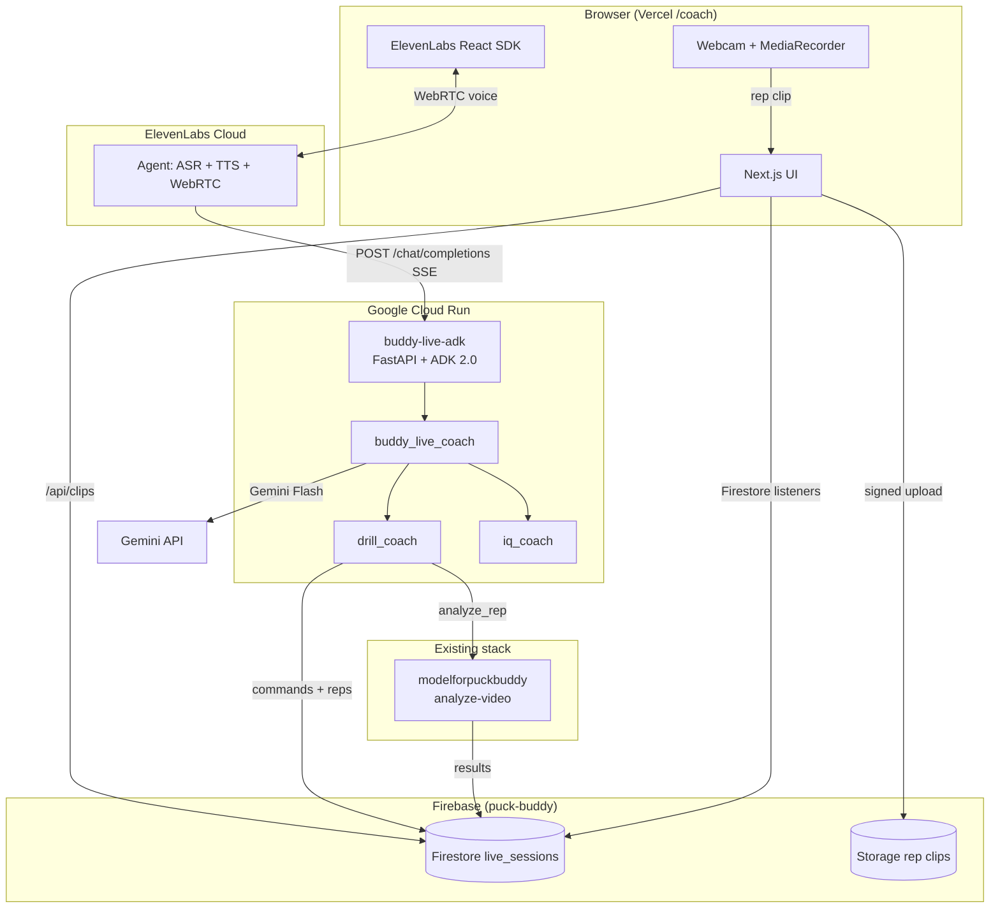
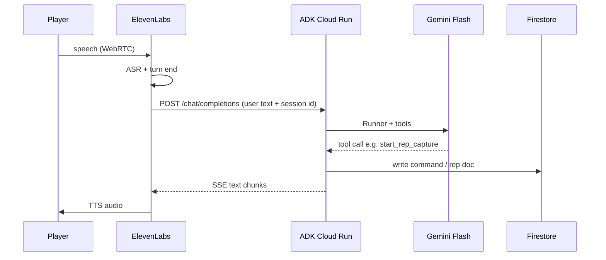
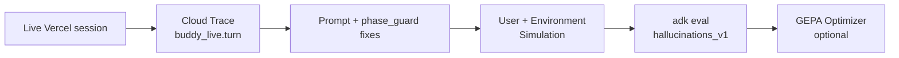

# Buddy Live — architecture diagram (submission)

## System overview

## One turn (voice → brain → voice)

## Track 2 optimization loop

## Hosting map

| Component | Where |
| --- | --- |
| Web app + API routes | Vercel |
| ADK agent | Cloud Run `buddy-live-adk` |
| Voice | ElevenLabs |
| Data + clips | Firebase |
| Shot scoring | `api.buddysports.app` |
| Drill grounding | Vertex AI Search |
