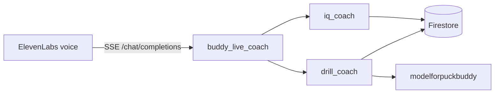

# Judge toolkit — evidence packet

Copy/paste friendly tables and links for Devpost, office hours, or README.

---

## Live links

| Resource | URL |
| --- | --- |
| **Coach UI** | [buddy-live-indol.vercel.app/coach](https://buddy-live-indol.vercel.app/coach) |
| **ADK health** | `https://buddy-live-adk-7iv2gspkgq-uc.a.run.app/health` |
| **Cloud Trace** | [console.cloud.google.com/traces/list?project=puck-buddy](https://console.cloud.google.com/traces/list?project=puck-buddy) |
| **GitHub** | [github.com/jakedibattista/buddy-live](https://github.com/jakedibattista/buddy-live) |

---

## Real session proof (Firestore)

`live_sessions/` TTL ~24h. **`session_summaries/`** persist — use these for judges.

### Full shooting flow — `live-3oxrisz06vae` (2026-06-03)

| Field | Value |
| --- | --- |
| Player | Jake, 15 |
| Drill | wristshot |
| Reps scored | 1 |
| Final phase | recap |
| Weakest metric | topHand (2.0) |
| Sample scores | frontKneeBend 4, weightTransfer 2.5, puckStartingPosition 7.5 |

Doc: `session_summaries/live-3oxrisz06vae`

### IQ path — `live-c6vkymv41exc` (2026-06-07)

| Field | Value |
| --- | --- |
| Player | Jake, 12 |
| Started | slapshot drill + warm-up |
| Ended in | `iq_practice` (8-question goal) |
| IQ card | Slapshot windup vs quick snap scenario |

Doc: `live_sessions/live-c6vkymv41exc` (may expire; summarize from this table if gone)

### Welcome-back

**Not in current production opening.** Root prompt calls `remember_player_profile` only. `load_player_memory` exists for future use / evals but is not invoked on connect. Do not demo Marcus seed for welcome-back.

---

## Synthetic eval results (`make eval` — happy path)

Baseline log: `services/buddy-live-adk/evals/baselines/pre-human-eval-happy.log` (2026-05-30)

| Scenario | Persona | Focus | hallucinations_v1 | Status |
| --- | --- | --- | --- | --- |
| Tyler, 11 | Novice | Wristshot + warm-up + reps | 0.84 | **PASSED** |
| Sam, 12 | Novice | No space → IQ coach | 0.53 | **PASSED** |
| Jordan, 13 | Expert | Slapshot, pushback on warm-up | 0.92 | **PASSED** |
| Riley, 10 | Novice | Framing struggle loop | 0.89 | **PASSED** |
| Alex, 11 | Novice | Analysis-wait impatience | 0.73 | **PASSED** |
| Marcus, 11 | Novice | Returning player (eval only) | 0.86 | **PASSED** |

**Set overall:** all 6 scenarios PASSED (threshold 0.5).

Reproduce:

```bash
cd services/buddy-live-adk
make eval
```

Edge injections:

```bash
make eval-failures
```

---

## Cloud Trace — what to screenshot

1. Run one live turn on Vercel (`/coach`).
2. Open [Trace Explorer](https://console.cloud.google.com/traces/list?project=puck-buddy).
3. Filter: `buddy_live.turn` or service `buddy-live-adk`.
4. Capture a trace showing:
   - Parent span `buddy_live.turn` with `buddy_live.session_id`
   - Child spans for ADK agent / LLM / tool calls (`set_focus_drill`, `start_rep_capture`, `analyze_rep`, `lookup_drill_knowledge`, etc.)

Env on Cloud Run: `BUDDY_ENABLE_CLOUD_TRACE=1`

---

## ADK sub-agents + tools (quick reference)



| Layer | Count |
| --- | --- |
| Sub-agents | 3 (+ root) |
| Tools | 16 |
| `phase_guard` gates | 7 tool families |
| Unit tests | 59 (`make test`) |

Full diagram: [ARCHITECTURE-DIAGRAM.md](./ARCHITECTURE-DIAGRAM.md)

---

## Track 2 checklist (for judges)

| Requirement | Evidence |
| --- | --- |
| Gemini API | `gemini-flash-latest` in ADK |
| ADK orchestration | Sub-agents + tools + callbacks |
| Cloud Run | `buddy-live-adk` service |
| Agent simulation | `evals/` + `make eval` |
| Environment simulation | `evals/environment_simulation.py` |
| Observability | Cloud Trace + Sentry |
| Grounding | Vertex AI Search + `lookup_drill_knowledge` |
| Optimizer | GEPA harness (`make optimize`) — seed retained |

---

## Deferred (honest limits — not demo blockers)

| Item | Status |
| --- | --- |
| Voice welcome-back on connect | Tool exists; prompt does not call it |
| Interrupt / barge-in button | SDK has mute duck only (`CoachAudioMuteButton`); hard interrupt deferred |
| ADK Workflow graph | Prompt-driven phases + `phase_guard` instead |
| Vertex Memory Bank | Firestore summaries + reconnect context instead |
| `modelforpuckbuddy` shot detector edge cases | Owner: other repo; `live-3oxrisz06vae` proves happy path |

---

## Submission doc index

| Doc | Purpose |
| --- | --- |
| [DEVPOST-1-PAGER.md](./DEVPOST-1-PAGER.md) | Paste into Devpost description / PDF |
| [DEMO-TALKING-POINTS.md](./DEMO-TALKING-POINTS.md) | 3-min video script |
| [ARCHITECTURE-DIAGRAM.md](./ARCHITECTURE-DIAGRAM.md) | Diagram asset |
| [../ARCHITECTURE.md](../ARCHITECTURE.md) | Full technical architecture |
